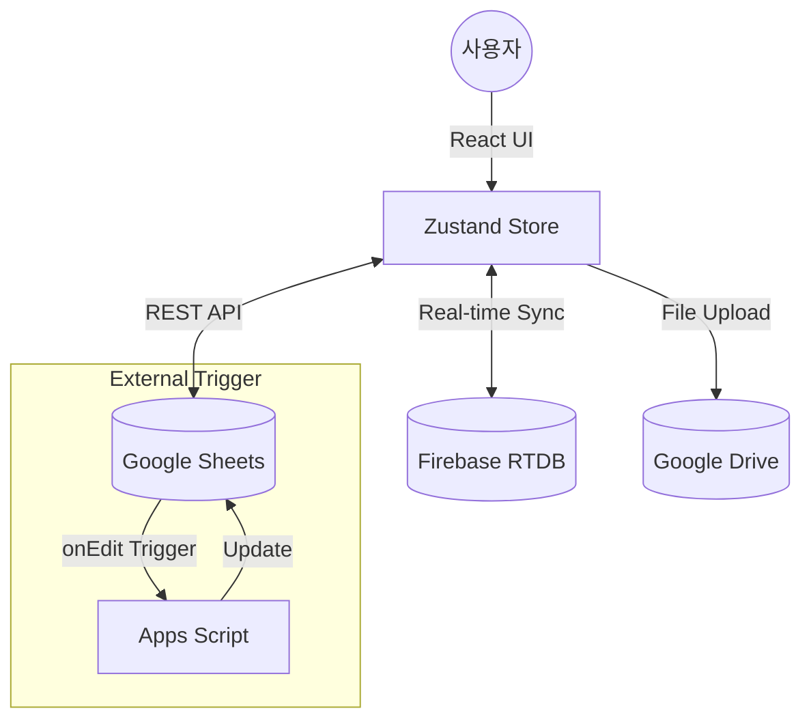

# Axiom LabFlow 시스템 아키텍처 가이드

본 문서는 Axiom LabFlow의 기술적 설계와 외부 서비스와의 통합 구조를 설명합니다.

----

## 1. 기술 스택 (Technology Stack)

### 1.1 프론트엔드 (Frontend)
*   **Core:** React (Vite 기반), TypeScript
*   **State Management:** **Zustand** (전역 상태 관리 및 `persist` 미들웨어를 통한 로컬 스토리지 유지)
*   **UI/UX:** Tailwind CSS, Radix UI (기본 컴포넌트), Lucide React (아이콘)
*   **Charts:** Recharts (실험 통계 가시화)

### 1.2 백엔드 & 인프라 (Backend & Infrastructure)
*   **Storage (Persistent):** **Google Sheets REST API v4** (데이터베이스 대용으로 활용)
*   **File Storage:** **Google Drive API** (실험 사진 및 증빙 자료 저장)
*   **Real-time Sync:** **Firebase Realtime Database (RTDB)** (사용자 상태, 실시간 타이머, 오늘 업무 공유)
*   **Authentication:** Google OAuth 2.0 (Sheets 및 Drive 접근 권한 획득)

---

## 2. 외부 서비스 통합 상세 (Service Integration)

### 2.1 Google Sheets 연동 (`sheetsApi.ts`)
시스템은 별도의 서버 엔진 없이 브라우저에서 직접 Sheets API를 호출합니다.
*   **Sync Logic:** `syncSheetsData` 함수가 여러 시트(Schedule, Reagent log, Chip info)를 `batchGet`으로 한 번에 불러와 Zustand Store에 병합합니다.
*   **Update Logic:** `sheetsBatchUpdate` 및 `sheetsAppend`를 사용하여 데이터 쓰기 및 로그 기록을 수행합니다.

### 2.2 Firebase 실시간 동기화 (`store.ts`)
팀원 간의 협업을 위해 Firebase RTDB의 `shared/` 노드를 활용합니다.
*   **Presence:** 사용자의 접속 상태 및 설정한 에모지 실시간 표시.
*   **Shared Timer:** 실험 시간을 팀원 전체가 동시에 확인 가능.
*   **Daily Reset:** 매일 첫 접속 시 `lastReset` 필드를 확인하여 "오늘의 업무" 및 "당일 시약 체크" 데이터를 초기화합니다.

---

## 3. 핵심 아키텍처 다이아몬드 (Data Flow)

---

## 4. 보안 및 권한 모델
*   **Access Token:** 사용자 로그인을 통해 획득한 Google Access Token을 사용하여 API를 호출합니다.
*   **Session ID:** 브라우저 탭 세션별로 고유 ID를 부여하여 다중 접속 시의 충돌을 방지합니다.
